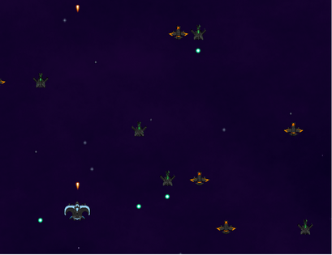

# Shooter game capstone project

## What is this project about? 

This project consisted on building a shooter game which you can play on the browser using Phaser 3 library (JavaScript). The aim of the project was to strengthen our knowledge on Object Oriented Programming by keeping our code clean and by making use of modules. I used Webpack as my bundler and I configured it to compilate code as well as different types of files (jpg, png, wav, etc.).

## Built with: 

- [Phaser 3](https://phaser.io/phaser3)

**Features**
- [npm](https://www.npmjs.com/)
- [Jest](https://jestjs.io/es-ES/)
- [ESlint](https://eslint.org/)

## Live demo link

[TwiTECH](https://nameless-escarpment-79956.herokuapp.com/)

## How to use this app locally?

**Pre-requisites**

- Having [Ruby](https://www.ruby-lang.org/en/) installed on your machine.

- Having [Rails](https://rubyonrails.org/) installed on your machine.

- Having [Postgresql](https://www.postgresql.org/) installed.

### Setting up instructions 

**In case you use Git**

1. Open terminal 

2. Run the following commands:

- $ git clone https://github.com/AlduLonghi/twitter-capstone

- $ cd twitter-capstone

- $ bundle install

- $ rails db:create

- $ rails db:migrate

- $ rails server

**In case you don't use a control version system**

1. Go to [the repository](https://github.com/AlduLonghi/twitter-capstone)

2. Press the green button that says "Code".

3. Press "Download zip".

4. Once downloaded, extract the files.

5. Right click on the folder, press "Open in terminal".

6. Run:

- $ rake db:create

- $ rake db:migrate

- $ rails server

### Running tests
 
1. Open terminal

2. Run:

- $ rspec

## Author 

👤 **Aldana**
​

- Github: [@AlduLonghi](https://github.com/AlduLonghi)

- Twitter: [@AbrilLonghi](https://twitter.com/AbrilLonghi)

- Linkedin: [Aldana Abril Longhi](https://www.linkedin.com/in/aldana-abril-longhi-a842ba1a7/)

## Contributing 

- To contribute to this project:
- Fork this repository & clone locally.
- Create an upstream remote and sync your local copy.
- Create a new branch.
- Push your code to your origin repository.
- Create a new Pull Request .

## Show your support

Give a ⭐️ if you like this project!
​

## Acknowledgments

- Microverse curriculum.